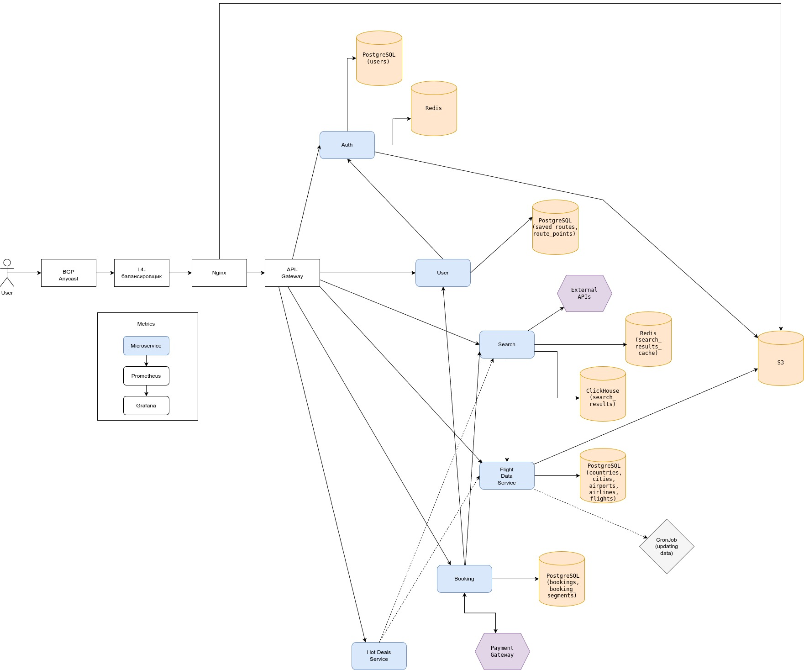

# Highload Aviasales
Онлайн-сервис для поиска и бронирования авиабилетов. Это метапоисковик, который анализирует предложения сотен авиакомпаний и агентств, чтобы найти самые низкие цены.

## Функционал MVP:
- Главная страница (список горящих билетов);
- Регистрация, авторизация;
- Профиль (сохранение и отображене избранных маршрутов) ;
- Поиск билетов и его фильтрация;
- Бронирование и покупка билетов;

## Целевая аудитория:
| Страна         | Процент аудитории | 
|--------------------|-------------------|
| **Россия**    | 87.41%          |
| **Германия**          | 1.55%         |
| **Нидерланды**| 1.23%          |
| **США**          | 0.96%        |
| **Беларусь**    | 0.75%          |

| Пол | Процент аудитории |
|------------|--------------|
| **Мужчины**  | 55.6% |
| **Женщины**  | 44.4% |

Самая многочисленная возрастная группа посетителей: 25–34 года.

## Расчет нагрузки
### Продуктовые метрики
- MAU - 19.5 млн человек;
- DAU - 2.9 млн человек;

#### Среднее количество действий пользователя по типам в день
- Главная страница: 2 755 000
- Поисковых запросов (включая фильтрацию): 4 920 000 (2 320 000 - поиск без фильтров)
- Бронирование и покупка билетов: 366 668
- Добавлений в избранное: 13 016
- Авторизация и регистрация: 130 165

### Технические метрики
#### Объем хранилища
| Тип | Средний размер | Количество объектов | Общий объем (ТБ) | Прирост в день (кол-во) | Прирост в день (ГБ) | Прирост в месяц (ГБ) |
|------------|--------------|--------------|--------------|--------------|--------------|--------------|
| Пользователи  | 1.5 КБ | 30 млн | 0.042 | 130165 | 0.19 | 5.59 | 
| Сохранённые маршруты  | 0.2 КБ | 150 млн | 0.028 | 13016 | 0.0025 | 0.074 | 
| История поисков  | 0.2 КБ | 3.48 млрд | 0.65 | 2320000 | 0.44 | 13.3 | 
| Бронирования и покупки  | 2.5 КБ | 561 млн | 1.2 | 366668 | 0.87 | 26.1 | 
| **Итого**  | |  | 1.92 | | | |

#### RPS
Формула для расчета: 

`Средний RPS = среднее количество действий пользователя по типам в день / 86400`

| Тип запроса | Средний RPS	 | Пиковый RPS (x3) |
|------------|--------------|--------------|
| Главная страница | 31.89 | 95.66  |
| Поиск и фильтрация | 56.94 | 170.83 |
| Бронирование и покупка | 4.24 | 12.73 |
| Регистрация и авторизация| 1.51 | 4.52 |
| Избранное | 0.151 | 0.453 |
| **Итого** | ~94.73 | ~284.19 |

#### Сетевой трафик
Формула для расчета: 

`Пиковое потребление = пиковый RPS * средний размер ответа (Кб) * 8 / 1024`

`Суточный трафик = запросов в день * средний размер ответа (Кб) / (1024 * 1024)`

| Тип | Пиковое потребление (Гбит/с) | Суммарный суточный (Гбайт/сутки) |
|------------|--------------|--------------|
| Главная страница | 37.37 | 131.37 |
| Поиск и фильтрация | 80.07 | 281.52 |
| Бронирование и покупка | 7.46 | 26.23 |
| Регистрация и авторизация| 0.35 | 1.24 |
| Избранное | 0.007 | 0.025 |
| **Итого** | ~125.26 | ~440.39 |

## Глобальная балансировка нагрузки

### Функциональное разбиение по доменам
- aviasales.ru – основное веб-приложение;
- api.aviasales.ru – API для мобильных приложений и SPA-клиента (регистрация и авторизация, поиск и фильтрация билетов, избранное, бронирование и покупка);
- static.aviasales.ru – статика (JS, CSS, изображения);
- booking.aviasales.ru – отдельный домен для оформления заказов и оплаты;

### Расположение датацентров
Так как 87% аудитории находится в России, рационально использовать ДЦ внутри страны. Исходя из этого, датацентры стоит расположить в Москве, Санкт-Петербурге, Екатеринбурге и Хабаровске.

### Схема глобальной балансировки
Поскольку все ДЦ расположены внутри страны, предлагается использовать схему балансировки BGP Anycast, с автоматической маршрутизацией пользовательского трафика до ближайшего ДЦ.

## Локальная балансировка нагрузки
При помощи DNS пользователь направляется в ближайщий ДЦ. Затем на транспортном уровне будут использоваться балансировщики, которые распределяют трафик по L7-балансировщикам. Алгоритм балансировки: Least Connections.
Для обеспечения отказоустойчивости используем схему Keepalived: на каждом L4 балансировщике поднимаем виртуальный IP, при падении главного хоста, резервный автоматически становится главным.

L4-балансировщики распределяют нагрузку на L7-балансировщики (Nginx). Алгоритмы балансировки:
- Round Robin — для лёгких сервисов (таких, как: авторизация, избранное, статика);
- Least Connections — для тяжёлых сервисов (например, для поиска билетов).

На L7-балансировщике (Nginx) происходит также SSL-терминация, чтобы снизить нагрузку на бэкенд.

## Логическая схема БД

| Таблица | Назначение |
|------------|--------------|
|users |Таблица пользователей | 
|countries |Таблица стран | 
|cities |Таблица городов | 
|airports |Таблица аэропортов | 
|airlines |Таблица авиакомпаний | 
|saved_routes |Таблица сохраненных маршрутов | 
|route_points |Таблица точек маршрута | 
|search_history |Таблица истории поиска | 
|search_results_cache |Таблица кэша результатов поиска | 
|bookings |Таблица бронирований | 
|booking_segments |Таблица сегмента бранирования | 
|flights |Таблица рейсов | 

## Физическая схема БД

| Таблица |Технология|
|------------|--------------|
|users |PostgreSQL (Citus) |
|countries |PostgreSQL (Citus) | 
|cities |PostgreSQL (Citus) | 
|airports |PostgreSQL (Citus) | 
|airlines |PostgreSQL (Citus) | 
|saved_routes |PostgreSQL (Citus) | 
|route_points |PostgreSQL (Citus) | 
|search_history |ClickHouse | 
|search_results_cache |Redis | 
|bookings |PostgreSQL (Citus) | 
|booking_segments |PostgreSQL (Citus) | 
|flights |PostgreSQL (Citus) | 

### Индексы
CREATE INDEX idx_users_email_lower ON users (lower(email)); — поиск пользователя по email при аутентификации.

CREATE INDEX idx_cities_country_id ON cities (country_id); — ускорение фильтрации по стране.

CREATE INDEX idx_airports_city_id ON airports (city_id); — ускорение фильтрации по городам.

CREATE INDEX idx_airports_name_tsv ON airports USING GIN (name_tsv); — ускорение поиска.

CREATE INDEX idx_airports_icao ON airports (icao) WHERE icao IS NOT NULL — ускорение поиска.

CREATE INDEX idx_saved_routes_user_updated ON saved_routes (user_id, updated_at DESC); 

CREATE INDEX idx_route_points_saved_route_id ON route_points (saved_route_id); — быстрая загрузка всех точек маршрута.

CREATE INDEX idx_bookings_user_id_status_active ON bookings (user_id) WHERE status IN ('confirmed', 'paid', 'processing'); — быстрая загрузка бронирований.

CREATE INDEX idx_booking_segments_airline_id ON booking_segments (airline_id); — быстрая загрузка всех точек маршрута.

CREATE INDEX idx_flights_is_hot_created ON flights (is_hot, created_at DESC) WHERE is_hot = true; — поиск "горящих" предложений.

### Шардирование

| Таблица |Подход|
|------------|--------------|
|users |Hash-шард по user_id (Citus hash)|
|countries |Реплицировать на все ноды | 
|cities |Реплицировать на все ноды | 
|airports |Реплицировать на все ноды | 
|airlines |Реплицировать на все ноды | 
|saved_routes |Коллокация с users по user_id (Citus colocated)| 
|route_points |Коллокация с saved_routes по saved_routes_id (Citus colocated)| 
|search_history |Шардирование по дате (ClickHouse) |
|bookings |Коллокация с users по user_id | 
|booking_segments |Коллокация с bookings по bookings_id | 
|flights |Реплицировать на все ноды | 

### Резервирование

| Таблица |Подход|
|------------|--------------|
|users |Master-Slave (1 синхронная и 1 асинхронная)|
|countries |Master-Slave (1 синхронная и 1 асинхронная) | 
|cities |Master-Slave (1 синхронная и 1 асинхронная) | 
|airports |Master-Slave (1 синхронная и 1 асинхронная) | 
|airlines |Master-Slave (1 синхронная и 1 асинхронная) | 
|saved_routes |Master-Slave (1 синхронная и 1 асинхронная)| 
|route_points |Master-Slave (1 синхронная и 1 асинхронная)| 
|search_history |ReplicatedMergeTree (2 реплики на шард, ClickHouse)|
|bookings |Synchronous replication (1 реплика)| 
|booking_segments |Synchronous replication (1 реплика) | 
|flights |Master-Slave (1 синхронная и 1 асинхронная) | 

### Резервное копирование

| База данных |Резервное копирование|
|------------|--------------|
|PostgreSQL |backup 1×/день + WAL каждые ≤15 мин|
|ClickHouse |backup 1×/день|

## Алгоритмы

|Алгоритм |Область примемения|Описание|
|------------|--------------|--------------|
|Meta-Search алгоритм | Поиск авиабилетов |Система, которая агрегирует результаты от множества других источников (агентств, авиакомпаний, GDS — Global Distribution Systems) и показывает пользователю единую выдачу с сортировкой, фильтрацией и объединением дубликатов. |
|Алгоритм ранжирования "Лучшие предложения"| Показ наиболее выгодных компании предложений сверху | Для одного и того же рейса/тарифа разные партнёры дают разную цену/комиссию/качество. Алгоритм решает какое предложение показывать, чтобы получить больше дохода/покупок |
|Алгоритмы прогнозирования цен |Совет «Покупать сейчас или подождать», аналитика динамики цен | Предсказывает будущую динамику цены на конкретный маршрут/дату: нужен ли срочный выкуп или можно подождать |
|Low-price calendar|Формирование календаря с минимальными ценами по дням/месяцам |Система собирает и агрегирует исторические и текущие цены на маршруты. Для каждой даты рассчитывает минимальную или медианную цену и отображает пользователю когда лететь дешевле всего |
|Алгоритмы для “Горящих” билетов (Real-time Scoring) |Поиск и уведомление о резком снижении цены / “горящих” предложениях |Потоковый скоринг в реальном времени анализирует поступающие обновления цен. Если цена резко упала или спрос вырос — модель присваивает высокий “hot-score”. Такие билеты выделяются как «горящие» |

## Технологии
|Технология |Область примемения|Мотивационная часть|
|------------|--------------|--------------|
| Golang               | Основная бизнес-логика backend и микросервисы| Поддержка многопоточности и микросервисной архитектуры Высокаяпроизводительность Быстрая разработка|
| Typescript           | Frontend| Статическая типизация облегчает разработку и поддержку кода|
| Python| ML-алгоритмы| Большое число библиотек для ML Простота разработки и поддержки|
| S3            | Хранение изображений| Хорошо горизонтально масштабируется Объектное хранилище - нет привязки к иерархии, структуре хранения и т.д. Отказоустойчивость - хорошо децентрализуется на физически удалённых устройствах, где данные реплицируются на нескольких узлах, составляя при этом единую систему|
| Redis                | Кэширование данных (поисковые запросы)| Быстрое in-memory хранилище|
| Kubernetes           | Управление контейнеризированными приложениями| Автоматизация развертывания, репликации Отказоустойчивость|
| CronJob              | Периодический запуск задач для алгоритмов выбора "горящих билетов" и алгоритма ранжирования| Планирование задач по расписанию Оптимизация использования ресурсов|
|Kafka / RabbitMQ| Асинхронная передача данных между сервисами, потоковая обработка событий| Сообщения между сервисами (например, обновление статуса бронирования, пересчёт hot-score) должны обрабатываться асинхронно и надёжно. Kafka или RabbitMQ обеспечивают масштабируемую очередность и доставку событий в реальном времени|
| Prometheus + Grafana | Мониторинг и визуализация метрик| Аналитика в реальном времен Автоматический сбор метрик Установка алертов|
| ClickHouse           | Хранение и аналитическая обработка истории поисков авиабилетов | Оптимизирован под высокопроизводительные аналитические запросы по огромным объёмам данных|
|PostgreSQL (Citus)| Основное хранилище данных (пользователи, бронирования, маршруты, авиакомпании, аэропорты)| PostgreSQL обеспечивает надёжность, транзакционность (ACID) и гибкость. Расширение Citus добавляет горизонтальное шардирование и коллокацию данных, что позволяет масштабировать систему и обрабатывать миллионы пользователей и бронирований без потери производительности|
| Nginx                |L7-балансировка, SSL-терминация, отдача статики| Лёгкий и производительный веб-сервер, позволяющий эффективно балансировать запросы между backend-сервисами и завершать SSL-сессии на уровне балансировщика, разгружая бэкенд|

## Схема проекта

## Обеспечение надёжности
|Компонент|Способ обеспечения надежности|
|------------|--------------|
|Nginx|Разворачиваем в двух экземплярах по схеме Active-Passive. Один узел работает как основной и принимает весь трафик, второй — резервный. Если активный инстанс выходит из строя, резервный автоматически продолжает обслуживать запросы|
|PostgreSQL (Citus)|Таблицы users, countries, cities, airports, airlines, saved_routes, route_points и flights: Master-Slave (1 синхронная и 1 асинхронная); bookings и booking_segments: Synchronous replication (1 реплика). \n  Graceful shutdown: \n 1)Перестаем принимать новый трафик \n 2) Завершаем текущие запросы \n 3) Завершаем работу PostgreSQL (Citus) |
|Redis|Схема резервирования: Master-Slave (одна асинхронная реплика) |

#### Статистика:
- MAU - 19.5 млн человек;
- Среднее количество страниц за посещение - 4.84;
- Средняя продолжительность посещения: 4 минуты 22 секунды;
- В месяц выполняется около 2 750 000 броней и покупок билетов. В год - 33 000 000;
- Всего просмотров в месяц - 94.5 млн;
- Каждый пятый авиабилет в России куплен с помощью Авиасейлс;
- Aviasales - самый популярный сервис по покупке авиабилетов в России (исследование компании Ipsos);
- Aviasales ищет рейсы 2000+ авиакомпаний; также он поддерживает рейсы в 220 стран мира;
- По верхней границе общее количество рейсов в день около 202 157;
- С учетом того, что в месяц просмотров страниц 94.5 млн, а среднее количество страниц за посещение - 4.84,- можно предположить, что запросов поиска идет около 30-39 млн в месяц.

#### Аналоги
- Kupibilet (3,6M MAU)
- Аэрофлот (12,7M MAU)
- S7 (5,2M MAU)
- Skyscanner (60M MAU)
- Kayak (37,2M MAU)
- Momondo (3,9M MAU)
- CheapOair (6,5M MAU)

### Источники:
1. https://aviastats.ru/
2. https://www.aviasales.ru/faq/kak-rabotaet-aviasales?opened_from=faq_main
3. https://www.aviasales.ru/countries
4. https://www.cy-pr.com/a/www.aviasales.ru
5. https://a.seolik.ru/aviasales.com?ysclid=mfeaeidmp9772601866
6. https://travel.rambler.ru/lifehack/45854738-skolko-samoletov-odnovremenno-letaet-v-nebe/?ysclid=mfebz4pkjy476845305
