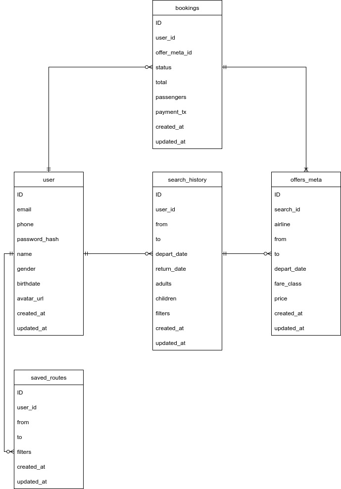

# Highload Aviasales
Онлайн-сервис для поиска и бронирования авиабилетов. Это метапоисковик, который анализирует предложения сотен авиакомпаний и агентств, чтобы найти самые низкие цены.

## Функционал MVP:
- Главная страница (список горящих билетов);
- Регистрация, авторизация;
- Профиль (сохранение и отображене избранных маршрутов) ;
- Поиск билетов и его фильтрация;
- Бронирование и покупка билетов;

## Целевая аудитория:
| Страна         | Процент аудитории | 
|--------------------|-------------------|
| **Россия**    | 87.41%          |
| **Германия**          | 1.55%         |
| **Нидерланды**| 1.23%          |
| **США**          | 0.96%        |
| **Беларусь**    | 0.75%          |

| Пол | Процент аудитории |
|------------|--------------|
| **Мужчины**  | 55.6% |
| **Женщины**  | 44.4% |

Самая многочисленная возрастная группа посетителей: 25–34 года.

## Расчет нагрузки
### Продуктовые метрики
- MAU - 19.5 млн человек;
- DAU - 2.9 млн человек;

#### Среднее количество действий пользователя по типам в день
- Главная страница: 2 755 000
- Поисковых запросов (включая фильтрацию): 4 920 000 (2 320 000 - поиск без фильтров)
- Бронирование и покупка билетов: 366 668
- Добавлений в избранное: 13 016
- Авторизация и регистрация: 130 165

### Технические метрики
#### Объем хранилища
| Тип | Средний размер | Количество объектов | Общий объем (ТБ) | Прирост в день (кол-во) | Прирост в день (ГБ) | Прирост в месяц (ГБ) |
|------------|--------------|--------------|--------------|--------------|--------------|--------------|
| Пользователи  | 1.5 КБ | 30 млн | 0.042 | 130165 | 0.19 | 5.59 | 
| Сохранённые маршруты  | 0.2 КБ | 150 млн | 0.028 | 13016 | 0.0025 | 0.074 | 
| История поисков  | 0.2 КБ | 3.48 млрд | 0.65 | 2320000 | 0.44 | 13.3 | 
| Бронирования и покупки  | 2.5 КБ | 561 млн | 1.2 | 366668 | 0.87 | 26.1 | 
| **Итого**  | |  | 1.92 | | | |

#### RPS
Формула для расчета: 

`Средний RPS = среднее количество действий пользователя по типам в день / 86400`

| Тип запроса | Средний RPS	 | Пиковый RPS (x3) |
|------------|--------------|--------------|
| Главная страница | 31.89 | 95.66  |
| Поиск и фильтрация | 56.94 | 170.83 |
| Бронирование и покупка | 4.24 | 12.73 |
| Регистрация и авторизация| 1.51 | 4.52 |
| Избранное | 0.151 | 0.453 |
| **Итого** | ~94.73 | ~284.19 |

#### Сетевой трафик
Формула для расчета: 

`Пиковое потребление = пиковый RPS * средний размер ответа (Кб) * 8 / 1024`

`Суточный трафик = запросов в день * средний размер ответа (Кб) / (1024 * 1024)`

| Тип | Пиковое потребление (Гбит/с) | Суммарный суточный (Гбайт/сутки) |
|------------|--------------|--------------|
| Главная страница | 37.37 | 131.37 |
| Поиск и фильтрация | 80.07 | 281.52 |
| Бронирование и покупка | 7.46 | 26.23 |
| Регистрация и авторизация| 0.35 | 1.24 |
| Избранное | 0.007 | 0.025 |
| **Итого** | ~125.26 | ~440.39 |

## Глобальная балансировка нагрузки

### Функциональное разбиение по доменам
- aviasales.ru – основное веб-приложение;
- api.aviasales.ru – API для мобильных приложений и SPA-клиента (регистрация и авторизация, поиск и фильтрация билетов, избранное, бронирование и покупка);
- static.aviasales.ru – статика (JS, CSS, изображения);
- booking.aviasales.ru – отдельный домен для оформления заказов и оплаты;

### Расположение датацентров
Так как 87% аудитории находится в России, рационально использовать ДЦ внутри страны. Исходя из этого, датацентры стоит расположить в Москве, Санкт-Петербурге, Екатеринбурге и Хабаровске.

### Схема глобальной балансировки
Поскольку все ДЦ расположены внутри страны, предлагается использовать схему балансировки BGP Anycast, с автоматической маршрутизацией пользовательского трафика до ближайшего ДЦ.

## Локальная балансировка нагрузки
При помощи DNS пользователь направляется в ближайщий ДЦ. Затем на транспортном уровне будут использоваться балансировщики, которые распределяют трафик по L7-балансировщикам. Алгоритм балансировки: Least Connections.
Для обеспечения отказоустойчивости используем схему Keepalived: на каждом L4 балансировщике поднимаем виртуальный IP, при падении главного хоста, резервный автоматически становится главным.

L4-балансировщики распределяют нагрузку на L7-балансировщики (Nginx). Алгоритмы балансировки:
- Round Robin — для лёгких сервисов (таких, как: авторизация, избранное, статика);
- Least Connections — для тяжёлых сервисов (например, для поиска билетов).

На L7-балансировщике (Nginx) происходит также SSL-терминация, чтобы снизить нагрузку на бэкенд.

## Логическая схема БД

| Таблица | Назначение |
|------------|--------------|
|user |Таблица пользователей | 
|search_history |Таблица поисковых запросов | 
|saved_routes |Таблица сохраненных маршрутов | 
|bookings |Таблица бронирований (покупок) | 
|offers_meta |Таблица деталей конкретного маршрута | 

### Расчет распределения нагрузки

| Таблица |Количество объектов |Средний размер  | Общий объем (ТБ) | QPS (на запись) | QPS (на чтение) |
|------------|--------------|--------------|--------------|--------------|--------------|
|user |30 000 000 | 1.5 KB |0.042 TB |1.68 |25 |
|search_history |3 480 000 000  |0.2 KB   |0.65 TB |56.94 |5 |
|saved_routes |150 000 000  |0.2 KB  | 0.028 TB |0.151 |2 |
|bookings |561 000 000 | 2.5 KB |1.20 TB |4.24 | 1.2 |
|offers_meta |1 946 645 00 |0.2 KB  |0.036 TB |56.94 |570 |

#### Статистика:
- MAU - 19.5 млн человек;
- Среднее количество страниц за посещение - 4.84;
- Средняя продолжительность посещения: 4 минуты 22 секунды;
- В месяц выполняется около 2 750 000 броней и покупок билетов. В год - 33 000 000;
- Всего просмотров в месяц - 94.5 млн;
- Каждый пятый авиабилет в России куплен с помощью Авиасейлс;
- Aviasales - самый популярный сервис по покупке авиабилетов в России (исследование компании Ipsos);
- Aviasales ищет рейсы 2000+ авиакомпаний; также он поддерживает рейсы в 220 стран мира;
- По верхней границе общее количество рейсов в день около 202 157;
- С учетом того, что в месяц просмотров страниц 94.5 млн, а среднее количество страниц за посещение - 4.84,- можно предположить, что запросов поиска идет около 30-39 млн в месяц.

#### Аналоги
- Kupibilet (3,6M MAU)
- Аэрофлот (12,7M MAU)
- S7 (5,2M MAU)
- Skyscanner (60M MAU)
- Kayak (37,2M MAU)
- Momondo (3,9M MAU)
- CheapOair (6,5M MAU)

### Источники:
1. https://aviastats.ru/
2. https://www.aviasales.ru/faq/kak-rabotaet-aviasales?opened_from=faq_main
3. https://www.aviasales.ru/countries
4. https://www.cy-pr.com/a/www.aviasales.ru
5. https://a.seolik.ru/aviasales.com?ysclid=mfeaeidmp9772601866
6. https://travel.rambler.ru/lifehack/45854738-skolko-samoletov-odnovremenno-letaet-v-nebe/?ysclid=mfebz4pkjy476845305
